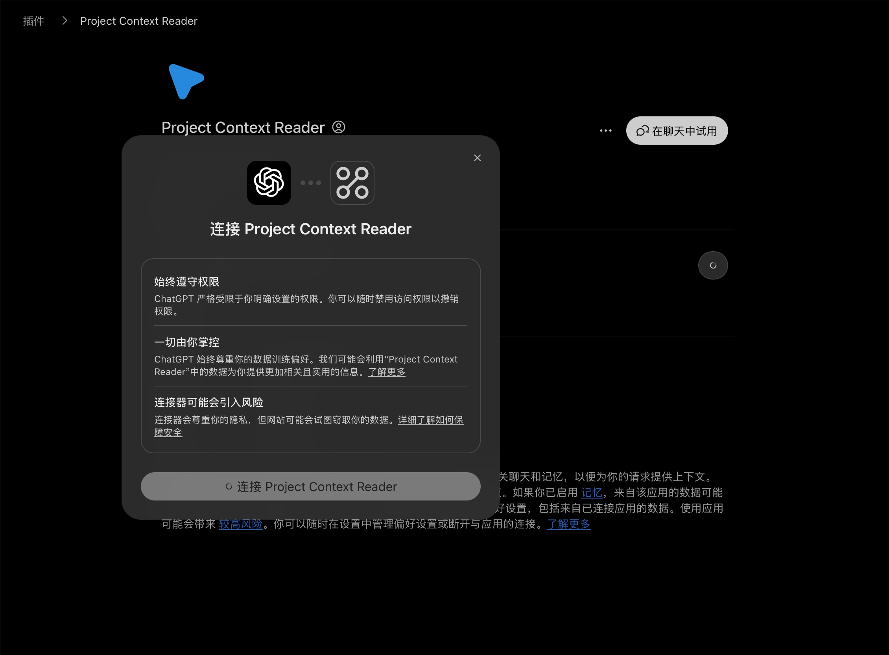
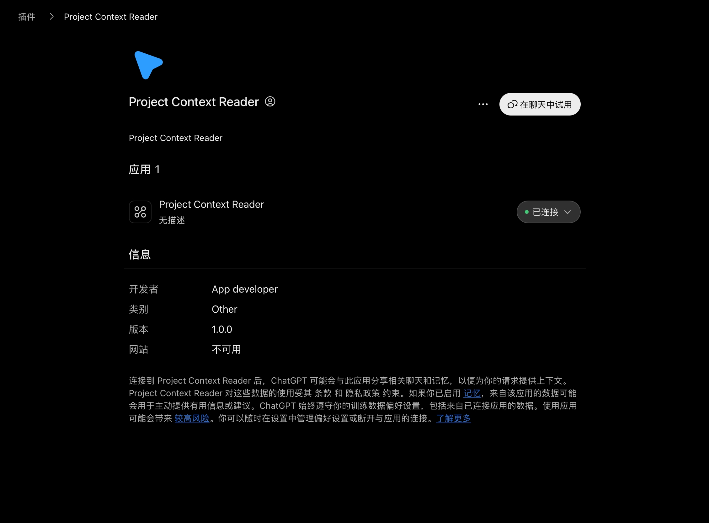

# Codex Context Reader

Use regular Chat on a Plus/Pro plan for read-only code analysis, leaving Codex usage for edits and tests. Codex Context Reader is a read-only [Model Context Protocol](https://modelcontextprotocol.io/) server that connects ChatGPT web to a user-selected project through a private Tunnel.

It returns only a project overview, search matches, and bounded file excerpts. This reduces unrelated context and token use. Actual usage depends on the model and request.

> **ChatGPT web requirement.** In a desktop browser, check **Plugins → Add → Create MCP app**. If this option is available, you can create a private Tunnel connection. OpenAI also documents a Developer mode setting under **Settings → Security and login**; the visible entry point may differ by account and UI version. [OpenAI Developer mode](https://developers.openai.com/api/docs/guides/developer-mode)

[简体中文](README.zh-CN.md) · [Install](#install-and-chatgpt-web-setup) · [Security](#security) · [Contributing](CONTRIBUTING.md)

## Install and ChatGPT web setup

### Optional: ask a local coding assistant to prepare the connection

Paste this into a coding assistant on the computer that contains the project. It installs, tests, and prepares the private Tunnel. Account settings and the hidden key stay with you.

```text
Set up https://github.com/dangzitou/codex-context-reader on this computer for read-only use in regular ChatGPT web through Secure MCP Tunnel. Make the smallest necessary changes.

1. Detect macOS, Linux, or Windows. Inspect the target before changing it. Clone or update the repository at ~/codex-context-reader on macOS/Linux, or %USERPROFILE%\codex-context-reader on Windows. Do not overwrite unrelated files.
2. Ensure Node.js 18+, Git, and ripgrep are available. Run npm test.
3. Tell me to open chatgpt.com in a desktop browser and check Plugins → Add → Create MCP app. If unavailable, check the documented Developer mode setting under Settings → Security and login. If neither entry is available, stop the ChatGPT-Tunnel setup.
4. Once I confirm MCP app creation is available: download tunnel-client only from the official OpenAI release or Platform Tunnel page, verify SHA-256 against the official checksum, and keep it in a user-owned local directory. Do not put it in this repository.
5. If I provide a tunnel_id, run npm run chat:tunnel -- --configure --tunnel-id <tunnel_id>. Otherwise tell me to create a Tunnel in Platform. Never create, request, print, store, or paste an API key into chat, files, Git, shell history, or logs.
6. Tell me the one remaining command to run in my own terminal: npm run chat:tunnel -- --prompt-key. Do not start the Tunnel unless I have entered the runtime key locally through that hidden prompt.
7. Once the client is ready, tell me to create an MCP app in ChatGPT Plugins: name it Project Context Reader, select Tunnel and its tunnel_id, choose No Authentication for this server, then create and connect it. Verify the green Connected state and test tool calls in a regular Chat using a nonsensitive sample project.

Do not expose the local project to the public internet. Do not modify any selected project.
```

### What you must do yourself

| Step | Why it stays with you |
| --- | --- |
| Open [chatgpt.com](https://chatgpt.com) in a desktop browser and check **Plugins → Add → Create MCP app** | ChatGPT must offer custom MCP app creation. |
| Create a Tunnel in [Platform settings](https://platform.openai.com/settings/organization/security/tunnels) | It belongs to your OpenAI organization and ChatGPT workspace. |
| Create a runtime API key and enter it in a local terminal | It is a credential; the launcher hides the input and does not save it. |
| In ChatGPT Plugins, create the Tunnel connection | This changes your ChatGPT account settings. |

If **Create MCP app** is unavailable, check the [documented Developer mode setting](https://developers.openai.com/api/docs/guides/developer-mode) under **Settings → Security and login**. If neither entry appears, this ChatGPT web setup is unavailable for your account; restarting the Tunnel cannot add the missing feature.

### Install and test the server

Requirements: Node.js 18+ and Git. Git context is optional. [`ripgrep`](https://github.com/BurntSushi/ripgrep) is optional too: without it, `search_code` uses a built-in bounded fallback search. Install OpenAI's `tunnel-client` using the [official Tunnel guide](https://developers.openai.com/api/docs/guides/secure-mcp-tunnels), verify its checksum, and put it on your `PATH` (or use `--client` with its absolute path in both launcher commands).

macOS/Linux:

```sh
git clone https://github.com/dangzitou/codex-context-reader.git "$HOME/codex-context-reader"
cd "$HOME/codex-context-reader"
npm test
```

Windows PowerShell:

```powershell
git clone https://github.com/dangzitou/codex-context-reader.git "$env:USERPROFILE\codex-context-reader"
Set-Location "$env:USERPROFILE\codex-context-reader"
npm test
```

If the repository is already cloned, use its existing directory instead.

### Start the private Tunnel

After the server is installed, MCP app creation is available, and you have a `tunnel_id`, configure the profile once:

```sh
cd "$HOME/codex-context-reader"
npm run chat:tunnel -- --configure --tunnel-id "your-tunnel-id"
```

Windows PowerShell:

```powershell
Set-Location "$env:USERPROFILE\codex-context-reader"
npm run chat:tunnel -- --configure --tunnel-id "your-tunnel-id"
```

Start it whenever you use ChatGPT web:

```sh
npm run chat:tunnel -- --prompt-key
```

The key input is hidden and stays only in the launched process environment. `doctor --explain` runs before the Tunnel starts. Keep this terminal open and wait until it reports `ready`.

### Add the connection in ChatGPT web

1. At [chatgpt.com](https://chatgpt.com), open **Plugins → Add → Create MCP app**.
2. Set the name to **Project Context Reader**. Under **Connection**, choose **Tunnel** and select or paste your `tunnel_id`; the `project-context-reader` label should appear beneath it.
3. Set **Authentication** to **No Authentication**: this local MCP server has no OAuth flow. The runtime API key authenticates `tunnel-client` separately. A description and icon are optional.
4. Acknowledge the risk notice, choose **Create**, review the discovered tools, and connect the app. This confirmation dialog should appear:



5. Confirm that the app page shows a green **Connected** status:



6. Click **Try in chat**, add the app to a regular Chat if prompted, and test with a nonsensitive local repository:

```text
Use Project Context Reader to read /Users/yourname/codex-context-reader. Call select_project, project_overview, search_code, and read_file, then summarize what you found with file paths. Do not modify files.
```

Replace `yourname` with your username (on Windows, use the full `C:\Users\...` path). Test only if this copy of the repository contains no private data. Check the Chat tool-call details for successful `select_project`, `project_overview`, `search_code`, and `read_file` results. A green Connected badge proves the connection, not that a project was read. The project ID expires after 30 minutes without reads; select the project again when it does. Keep `tunnel-client` running while using Chat.

OpenAI documents Secure MCP Tunnel as an outbound connection for private MCP servers; it does not require an inbound public port. [Tunnel guide](https://developers.openai.com/api/docs/guides/secure-mcp-tunnels)

## What it reads

| Tool | Purpose |
| --- | --- |
| `select_project` | Select an absolute local directory after user approval. Returns a random project ID. |
| `project_overview` | Read the root or any project-relative directory, the branch, working-tree status, and recent commits. |
| `search_code` | Search literal text in the selected project, optionally narrowed by a file glob. |
| `read_file` | Return up to 400 lines each from 1-8 selected-project files in one call, with continuation hints. |
| `git_context` | Read Git status, diff summary, and recent commits. |

## Security

- Reads stay within the chosen directory after resolving symlinks.
- Project IDs are random, memory-only, and expire after 30 minutes of inactivity or when the server stops.
- `read_file` blocks `.git`, dependencies, output directories, `.env*`, certificates, and common key files. `search_code` currently does not exclude every certificate/key extension: use only nonsensitive repositories until this is fixed.
- The server does not modify project files or run project code.
- Tool results become ChatGPT context. Use only with repositories your organization permits you to share.
- Secure MCP Tunnel is outbound-only. It does not open an inbound port or publish the project on the internet.

## Development

```sh
npm test
```

The tests exercise MCP initialization, project selection, token-scoped reads, traversal rejection, subdirectory listings, batch reads, glob-filtered and fallback search, selection idle-renewal and expiry, and Tunnel-launcher argument generation.

## License

[MIT](LICENSE) © Deng Zitao
