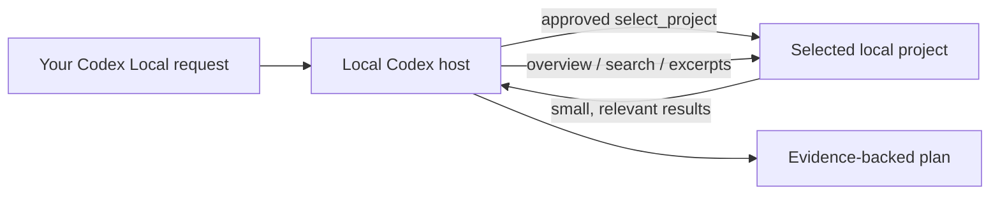

# Codex Context Reader

A read-only [Model Context Protocol](https://modelcontextprotocol.io/) plugin for **local projects in the ChatGPT desktop app** and Codex. It lets ChatGPT or Codex inspect a local project only when you select it, retrieving code on demand instead of pasting an entire repository into a conversation.

This is intended to reduce unnecessary prompt context and token use. Actual token consumption depends on the model and the questions asked.

[中文](#中文) · [Where it runs](#where-it-runs) · [Installation](#installation) · [Security](#security) · [Contributing](CONTRIBUTING.md)

## Where it runs

| Surface | Local project tools |
| --- | --- |
| ChatGPT desktop app, **local project** chat or ChatGPT Work | Supported; start a new chat after installation |
| ChatGPT desktop app, **Codex → Local** task or Codex CLI | Supported |
| Existing Quick Chat without a local project | The plugin may appear without its local tool catalog; create a local project chat |
| ChatGPT on the web or mobile | Not supported by this local stdio server |

Choose **Work in a project**, attach the local folder, and start a new chat from that project. Then type `/mcp` to confirm that `project-context-reader` is connected before sending your request. The plugin process runs on your computer, so a hosted web or mobile chat cannot start it.

## What it does

- Select a local project for the current MCP session without restarting ChatGPT or Codex.
- Show a compact project and Git overview.
- Search literal code text with `ripgrep`.
- Read bounded file excerpts with line numbers.
- Summarize uncommitted Git changes and recent commits.

It never modifies project files, runs project code, reads `.git` metadata, or returns likely secret files such as `.env`, PEM, and key files.

## How it saves context

Instead of attaching a repository or pasting files into ChatGPT, ask a question and let the model retrieve only the relevant overview, search results, and file ranges. This keeps most unrelated code outside the model context.



## Requirements

- ChatGPT desktop app with a local project chat or ChatGPT Work, or Codex CLI.
- [Codex CLI](https://developers.openai.com/codex/cli/) on `PATH` for the one-command installer.
- Node.js 18 or later.
- [`ripgrep`](https://github.com/BurntSushi/ripgrep) (`rg`) for code search.
- Git is optional, but enables branch, status, diff, and commit context.

## Installation

The plugin must be cloned under your home directory because ChatGPT's personal marketplace resolves plugins from `~/plugins/` (or `%USERPROFILE%\\plugins\\` on Windows).

### Install with Codex

You can paste this prompt directly into a local Codex chat. It chooses the correct macOS or Windows path itself:

```text
Install https://github.com/dangzitou/codex-context-reader as a personal ChatGPT desktop plugin on this computer. Clone it into the required home-directory plugins path for this operating system, but inspect an existing target first and do not overwrite unrelated files. Run its documented npm installer, verify that `codex plugin list` shows `project-context-reader@personal` as installed and enabled, and tell me how to invoke it in a new local project chat. Only change the cloned plugin directory and the personal marketplace file required by its installer.
```

The prompt installs the plugin once. Selecting or switching a project later happens with `select_project` inside a new local project chat; it does not require another install or restart.

### macOS

Install the prerequisites if needed:

```sh
brew install node ripgrep git
```

Clone and install the plugin:

```sh
mkdir -p "$HOME/plugins"
git clone https://github.com/dangzitou/codex-context-reader.git "$HOME/plugins/project-context-reader"
cd "$HOME/plugins/project-context-reader"
npm run install:plugin
```

The installer creates or updates `~/.agents/plugins/marketplace.json` and installs `project-context-reader` from your Personal marketplace. If the plugin does not appear, restart the ChatGPT desktop app once after this initial installation.

### Windows (PowerShell)

Install Node.js LTS and Git from their official installers, then install ripgrep:

```powershell
winget install BurntSushi.ripgrep.MSVC
```

Clone and install the plugin:

```powershell
New-Item -ItemType Directory -Force "$env:USERPROFILE\plugins" | Out-Null
git clone https://github.com/dangzitou/codex-context-reader.git "$env:USERPROFILE\plugins\project-context-reader"
Set-Location "$env:USERPROFILE\plugins\project-context-reader"
npm run install:plugin
```

If the plugin does not appear, restart the ChatGPT desktop app once after this initial installation. If `codex` is not on `PATH`, open the app's Plugins page and install **Project Context Reader** from the Personal marketplace after running the script.

### Verify

In the ChatGPT desktop app, select **Work in a project**, attach the project folder, and create a new chat from that project. Type `/mcp` and confirm that `project-context-reader` is connected. Then type `@Project Context Reader` and send a request with an absolute local path:

```text
Read /Users/alex/work/payments-service. First inspect the project, then propose an implementation plan. Do not modify files.
```

On Windows, use a drive-letter path:

```text
Read C:\Users\Alex\source\payments-service. First inspect the project, then propose an implementation plan. Do not modify files.
```

ChatGPT asks you to approve `select_project`. That selection is kept only in the current MCP session. To switch projects, state the new absolute path in the same chat; no configuration edit or restart is required.

## Tools

| Tool | Purpose |
| --- | --- |
| `select_project` | Select one absolute local directory for this session. Requires approval. |
| `project_overview` | Read root-level structure, branch, working-tree status, and recent commits. |
| `search_code` | Search literal text while excluding dependencies, output, and likely secret files. |
| `read_file` | Return up to 400 lines from a project-relative text file. |
| `git_context` | Read Git status, diff summary, and five recent commits. |

## Security

- The project is selected explicitly through an approval-gated tool.
- Selection is in memory only and disappears when the MCP session ends.
- File reads stay inside the selected directory after resolving symlinks.
- The server blocks `.git`, `node_modules`, common output directories, `.env*`, and common key-file extensions.
- This is a local MCP server. The code excerpts it returns are still sent to the ChatGPT conversation. Use it only with repositories that your organization permits you to share with ChatGPT.

Please report vulnerabilities privately as described in [SECURITY.md](SECURITY.md).

## Development

```sh
git clone https://github.com/dangzitou/codex-context-reader.git
cd codex-context-reader
npm test
```

The test starts the server over stdio, performs an MCP initialization, checks the tool catalog, selects a project, reads a file, searches code, and verifies path-traversal rejection.

## License

[MIT](LICENSE) © Deng Zitao

---

<a id="中文"></a>

# 中文

Codex Context Reader 是一个面向 **ChatGPT 桌面端本地项目**和 Codex 的只读 MCP 插件。它让 ChatGPT 或 Codex 在你确认后按需检索本地项目，而不是把整个仓库或大量文件直接放进对话。

它的目标是减少无关代码进入上下文，从而节省不必要的 token。实际 token 消耗仍取决于模型和具体提问。

## 适用范围

| 使用界面 | 本地项目工具 |
| --- | --- |
| ChatGPT 桌面端的**本地项目**聊天或 ChatGPT Work | 支持；安装后需新建聊天 |
| ChatGPT 桌面端的 **Codex → Local** 任务或 Codex CLI | 支持 |
| 未绑定本地项目的既有 Quick Chat | 插件可能显示但没有本机工具目录；请新建本地项目聊天 |
| 网页版或移动端 ChatGPT | 此本地 stdio 服务不支持 |

选择 **在项目中工作**，绑定本地目录，并从该项目新建聊天。发送请求前先输入 `/mcp`，确认 `project-context-reader` 已连接。插件进程运行在本机，网页版或移动端的托管会话无法启动它。

## 功能

- 在同一会话中动态切换本地项目，不需要重启 ChatGPT 或 Codex。
- 获取项目结构、Git 分支和近期提交概览。
- 使用 `ripgrep` 精确搜索代码。
- 按行读取最多 400 行文件内容。
- 获取未提交改动摘要和近期 Git 提交。

插件不修改任何项目文件，不执行项目代码，不读取 `.git` 内容，并会屏蔽 `.env`、证书和常见密钥文件。

## 安装

请按上方的 [macOS](#macos) 或 [Windows](#windows-powershell) 步骤安装。首次安装后重启一次 ChatGPT 桌面端即可；之后在新的本地项目聊天中切换项目时只需提供新的绝对路径。

### 让 Codex 自动安装

把下面整段直接发给本机的 Codex 即可。它会根据当前系统选择 macOS 或 Windows 的正确路径：

```text
请把 https://github.com/dangzitou/codex-context-reader 安装为这台电脑上 ChatGPT 桌面端的个人插件。请按当前操作系统把仓库 clone 到用户主目录下该插件要求的 plugins 路径；如果目标目录已经存在，先检查内容，不要覆盖无关文件。运行仓库 README 中的 npm 安装脚本，随后用 `codex plugin list` 验证 `project-context-reader@personal` 已安装且已启用，并告诉我如何在新建本地项目聊天中调用它。除克隆出的插件目录和安装脚本必需的个人 marketplace 配置文件外，不要修改其他文件。
```

这段提示词只需用于首次安装。之后在本地项目聊天中用 `select_project` 选择或切换项目，不需要再次安装或重启。

在 ChatGPT 桌面端选择 **在项目中工作**，绑定项目目录并新建聊天；先用 `/mcp` 确认 `project-context-reader` 已连接后输入：

```text
使用 Project Context Reader 读取 /Users/你的用户名/work/项目名。先了解项目结构和关键代码，再给我实施方案；不要修改文件。
```

出现 `select_project` 确认时，核对路径后批准即可。随后要切换项目时，直接告诉 ChatGPT 新路径，无须再次安装或重启。

## 安全与数据边界

- `select_project` 需要人工确认，且仅在当前 MCP 会话中有效。
- 读取范围被限制在已选择项目内，符号链接也会校验真实路径。
- 插件返回到 ChatGPT 的代码片段会成为对话上下文；请仅对公司允许提供给 ChatGPT 的代码库使用。

欢迎阅读 [贡献指南](CONTRIBUTING.md)，并按 [MIT 许可证](LICENSE) 使用和分发本项目。
